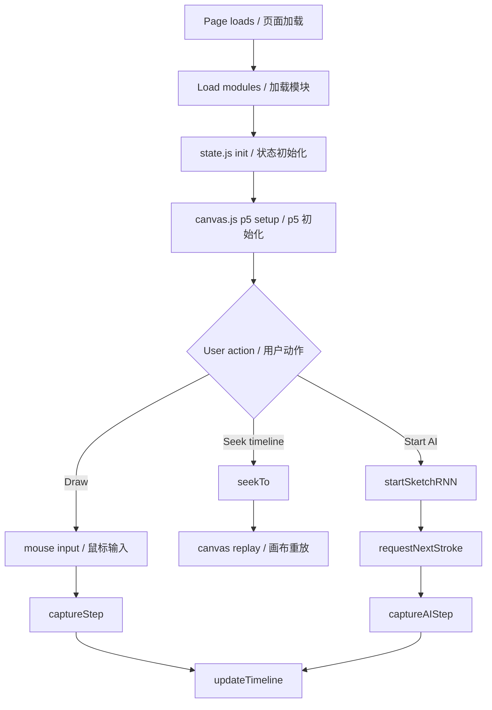
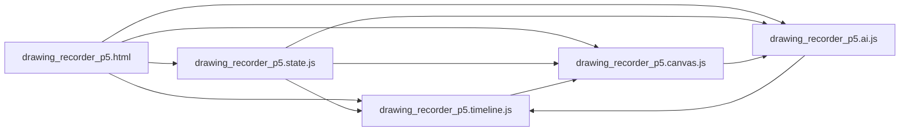

# AIdrawing Diagrams / AIdrawing 流程与依赖图

## 1. Runtime Flowchart / 运行流程图

## 2. Dependency Graph / 依赖关系图

## 3. Quick Notes / 快速说明

- Global shared state keeps code simple but increases coupling.
- Timeline/AI/Canvas all read and write the same `session` timeline.

- 共享全局状态让代码更直观，但耦合会更强。
- 时间轴/AI/画布都围绕同一份 `session` 数据工作。
